# Mutfak Asistanim

**Mutfak Asistanim**, evdeki gida urunlerini duzenli sekilde takip etmeyi, son kullanma tarihlerini goz onunde bulundurmayi ve eldeki malzemelere uygun tariflerle planli tuketimi desteklemeyi amaclayan bir mutfak asistanidir. Uygulama; buzdolabi envanteri, alisveris listesi, bildirimler, tarif kesfi ve yapay zeka destekli urun tarama gibi ozelliklerle israfi azaltmaya ve gunluk mutfak rutinini sadelestirmeye odaklanir.

Proje **dort kisilik bir ekip** tarafindan gelistirilmistir:

- Ayşe Arpacı
- Elif Kavurga
- Edanur Ayıbasan
- Uğur Nusretoğlu

---

## Kullanilan teknolojiler

### Mobil ve istemci (Flutter)

- **Flutter** (Dart SDK ^3.11), Material tasarim
- **HTTP** ile REST API iletisimi
- **Google ML Kit Text Recognition** — etiket / metin okuma
- **TensorFlow Lite** (`tflite_flutter`) — cihaz uzerinde urun tarama ve oneri akisi
- **Camera**, **image_picker**, **image** — kamera ve goruntu isleme
- **mobile_scanner** — barkod / QR tarama
- **Open Food Facts** entegrasyonu (urun bilgisi servisi)

### Sunucu (Spring Boot)

- **Java 17**, **Spring Boot 4** (Maven)
- **Spring Web MVC**, **Spring Data JPA**, **Spring Security**
- **PostgreSQL** (uretim / Railway), **H2** (gelistirme)
- **JWT** (jjwt) — kimlik dogrulama ve oturum yonetimi
- **Lombok**

### Altyapi

- **Railway** uzerinde ornek kurulum: ayri backend ve Flutter web servisleri, PostgreSQL; istemci tarafinda `BACKEND_URL` ile API erisimi (ayrintilar asagida).

---

## Uygulama goruntuleri

Asagidaki goruntuler `resimler/` klasorundedir. Hepsi ayni goruntu genisliginde (210 px) olacak sekilde ayarlanmistir; tablo kullanilmamistir.

### Tanitim (onboarding)

<p align="center">
  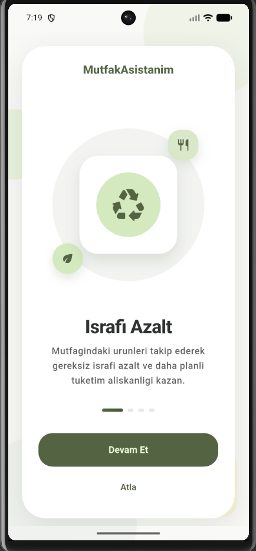
  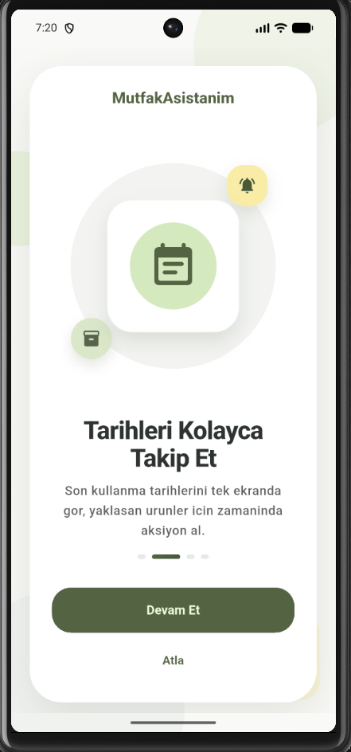
  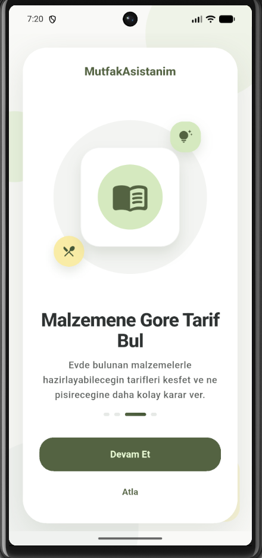
  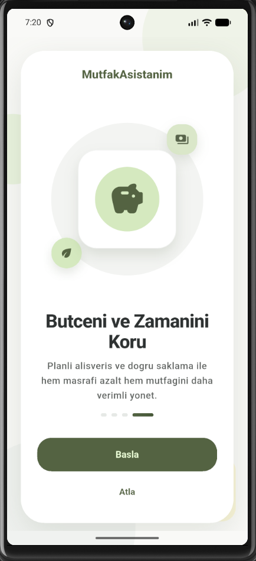
</p>

### Giris ve kayit

<p align="center">
  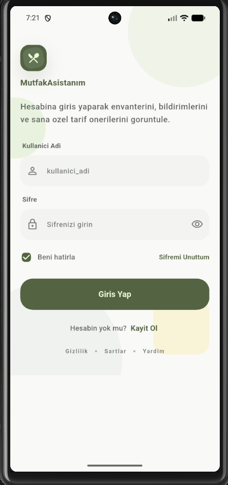
  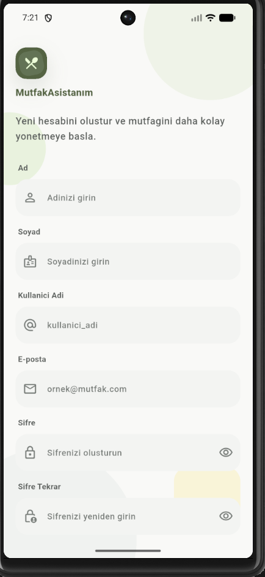
</p>

### Ana ekran, buzdolabi ve tarama

<p align="center">
  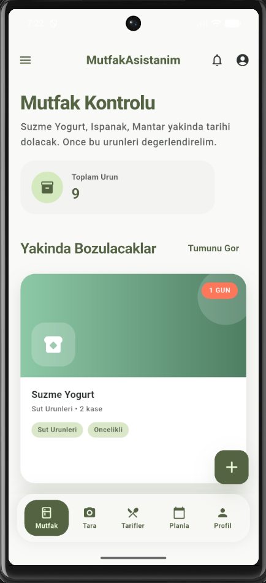
  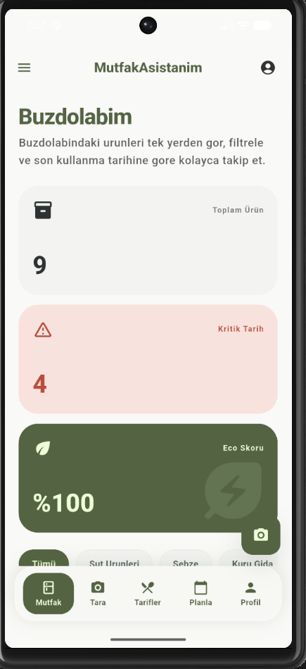
  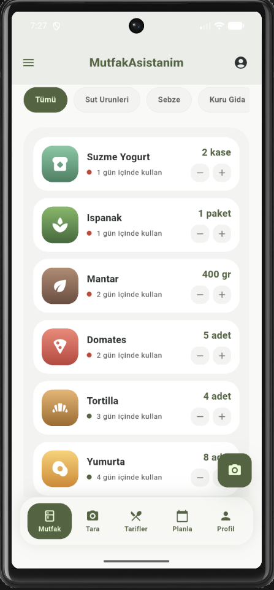
</p>

<p align="center">
  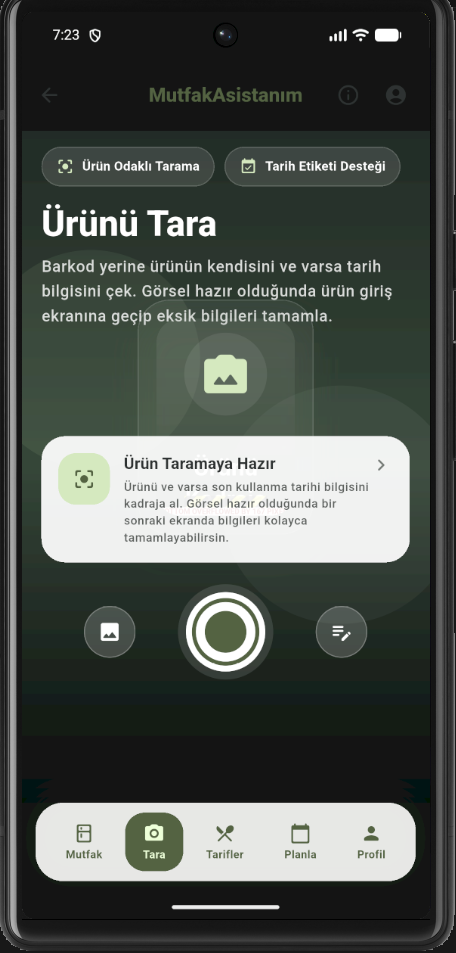
  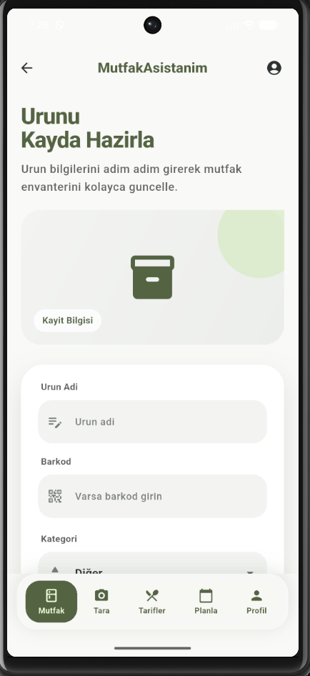
  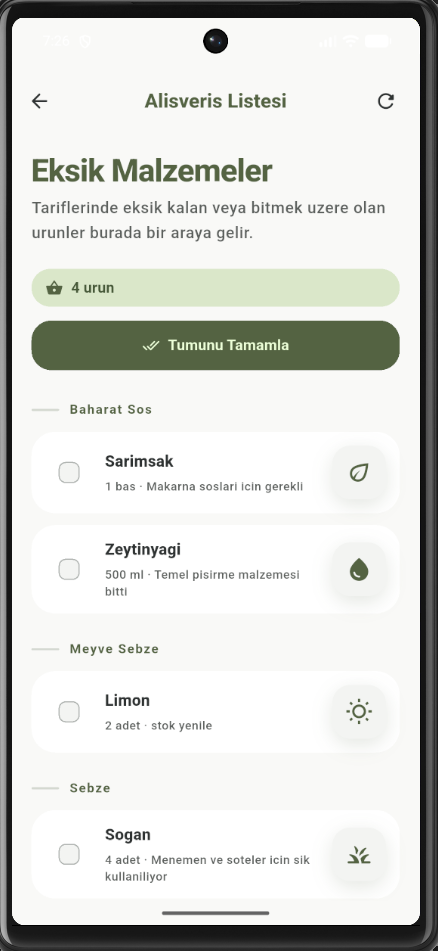
  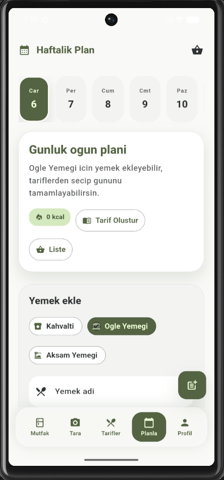
</p>

### Tarifler

<p align="center">
  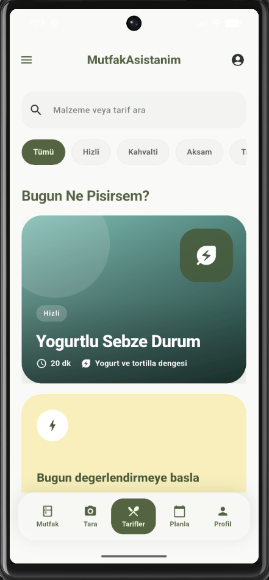
  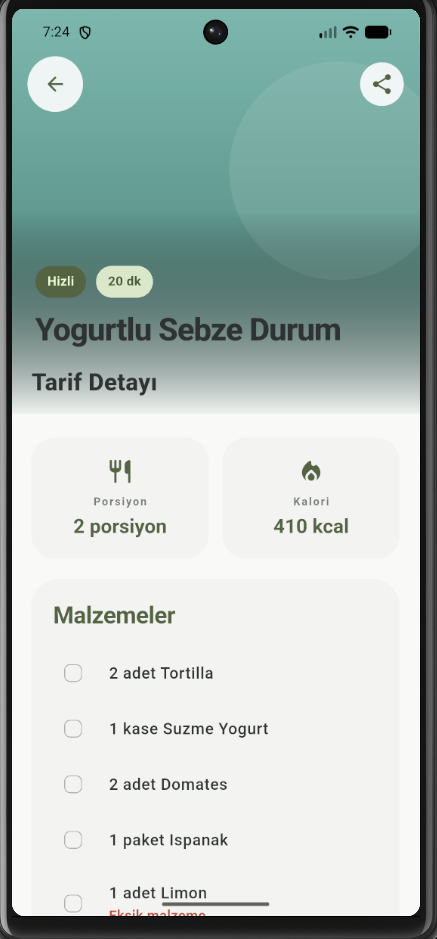
  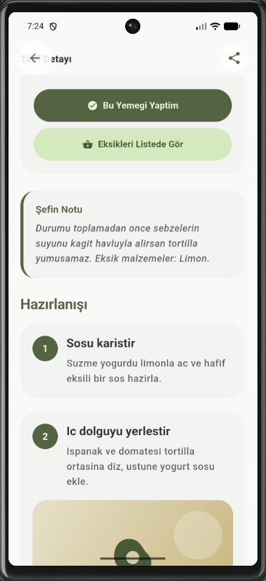
</p>

### Profil, bildirimler ve ayarlar

<p align="center">
  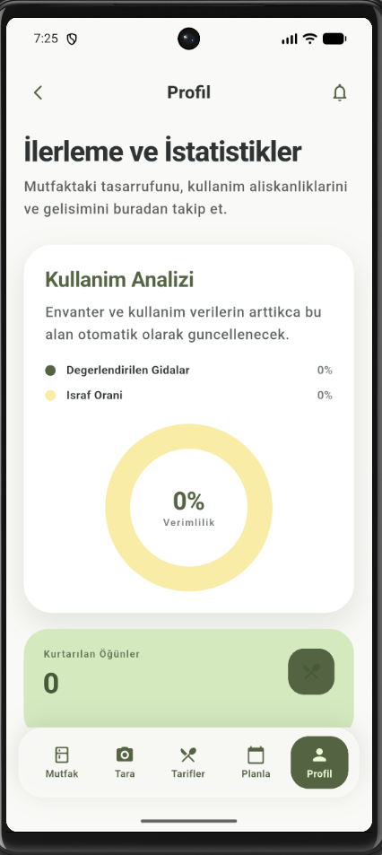
  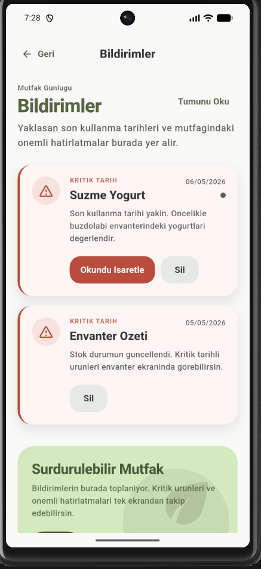
  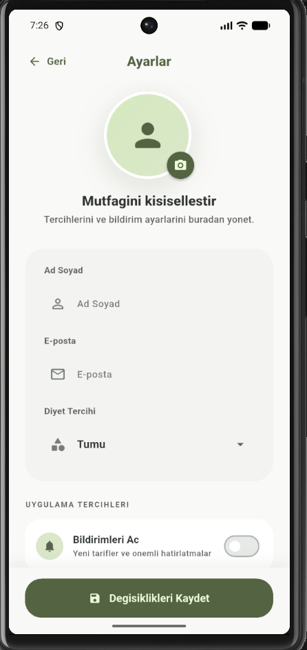
</p>

---

## Depo yapisi

| Klasor | Aciklama |
| --- | --- |
| `mutfak_asistanim/` | Flutter uygulamasi (Android, iOS, web vb.) |
| `backend/` | Spring Boot REST API |
| `resimler/` | README ve sunumlar icin ekran goruntuleri |

---

## Yerel calistirma (kisaca)

**Backend:** `backend` dizininde Maven ile Spring Boot uygulamasini baslatin; `application.properties` icinde veritabani ayarlarini kullanin.

**Flutter:** `mutfak_asistanim` dizininde:

```bash
flutter pub get
flutter run
```

Mobil veya fiziksel cihazda API adresini vermek icin:

```bash
flutter run --dart-define=API_BASE_URL=https://<backend-public-domain>
```

---

## Railway dagitimi (ozet)

- **Backend servisi:** Root Directory `backend`, degiskenler: `JWT_SECRET`, PostgreSQL baglanti bilgileri (`PGHOST`, `PGPORT`, vb.). Saglik kontrolu: `/health`.
- **Frontend servisi:** Root Directory `mutfak_asistanim`, `BACKEND_URL=http://${{backend.RAILWAY_PRIVATE_DOMAIN}}` (servis adi Railway’deki backend adiyla ayni olmali). Saglik kontrolu: `/health`.
- Veritabani: PostgreSQL; backend sirasiyla `DB_URL` / `SPRING_DATASOURCE_URL` / `PG*` degiskenlerini okuyacak sekilde yapilandirilmistir.
